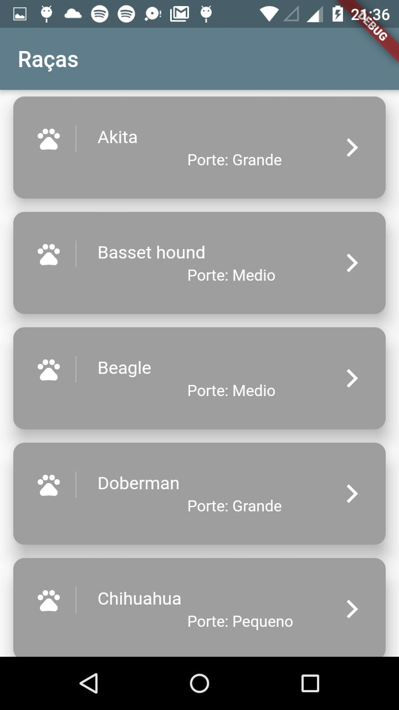
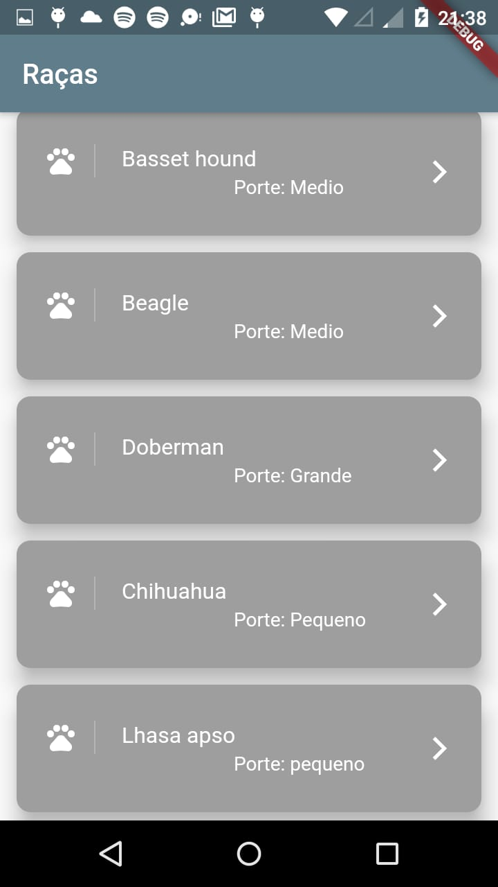

<h1>Raças de cães - Flutter</h1>
 

Meu primeiro app feito em Flutter, um aplicativo simples feito para listar raças de cães e mostrar os detalhes de acordo com a raçã selecionada

 

   
<h2>Tela de listagem de raças de cães</h2>
 

 

   
<h2>Tela de detalhes sobre a raça</h2>
 

 

